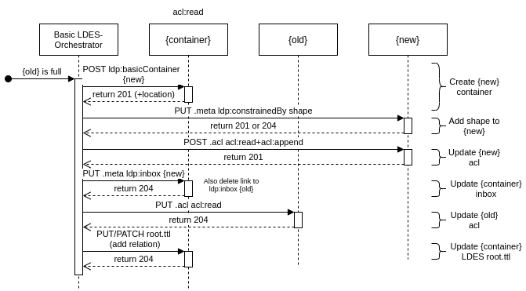

# LDES-Orchestrator
Fills the gaps that a Linked Data Platform (LDP) cannot do by itself for creating a Linked Data Event Stream (LDES) in LDP.

## How to use
in src a .env has to be made with as content the identity provider (e.g. SOLID_IDP=https://broker.pod.inrupt.com )

```bash
npm install

npm run orchestrate
```

Currently it only does an authenticated fetch to tree.linkeddatfragments.org/announcements using the broker.pod.inrupt.com idp

## Session

more information see https://docs.inrupt.com/developer-tools/javascript/client-libraries/tutorial/authenticate-nodejs/

Credentials can be obtained by executing login

```bash
npm run login
```

 After logging in, the credentials of the session will be printed to standard out

```bash
These are your login credentials:
{
  "refreshToken" : "4sIKfVp0fOEQA2hit0LG9uk6O93CCahn",
  "clientId"     : "jpPcrTavRaZN5YPxryBxxpKt19hFgEVi",
  "clientSecret" : "R7Ji4CBLTl3KndHtkYlLq15vb3ZIXJW9",
  "issuer"       : "https://broker.pod.inrupt.com/",
}
```

Plug the credentials into this bit of code to get a session.

Warning: when you use the credentials once, you will have to log in again to get new credentials.

```javascript
const { Session } = require("@inrupt/solid-client-authn-node");

credentials = {
    "clientId": "jpPcrTavRaZN5YPxryBxxpKt19hFgEVi",
    "clientSecret": "R7Ji4CBLTl3KndHtkYlLq15vb3ZIXJW9",
    "issuer": "https://broker.pod.inrupt.com/",
    "refreshToken": "4sIKfVp0fOEQA2hit0LG9uk6O93CCahn",
}

const session = new Session();
session.onNewRefreshToken((newToken: string): void => {
                          console.log("New refresh token: ", newToken);
});
await session.login({
    clientId: credentials.clientId,
    clientSecret: credentials.clientSecret,
    refreshToken: credentials.refreshToken,
    oidcIssuer: credentials.issuer,
});
```

## Using LDESinSolid

### Existing LDES in LDP

Requirements

* have the `base` IRI of an LDES in LDP (e.g. https://tree.linkeddatafragments.org/announcements)
* have acl:Control rights in the base (more information about ACL: https://solid.github.io/web-access-control-spec/)
* have a session (see [Session](#session))

```javascript
const { LDESinSolid } = require('@treecg/ldes-orchestrator');

const base = ... ;
const session = ... ;
const config = LDESinSolid.getConfig(base);
const ldes = new LDESinSolid(config.LDES, config.ACL, session);

// now you can do stuff with the ldes
// get amount of resources of the current container to which can be written
console.log(await ldes.getAmountResources());

// create a new container to which MUST be written
await ldes.createNextContainer();
```


### Creating a new LDES in LDP instance

Requirements

* have a solid pod where you have `acl:Control` rights to when logged in with a `session`
* create a `base` IRI in that solid pod

e.g.
https://solid.pod.com/ is the pod where you have acl:Control, then the `base` can be https://solid.pod.com/base/
```javascript
const { LDESinSolid } = require('@treecg/ldes-orchestrator');

const session = ... ;
const ldesConfig = {
    base : ... ,
    treePath: ... , // valid shacl path
    shape: ... , // IRI of the shape (to which all the members of the EventStream must conform to) (note: currently only SHACL shapes)
    relationType ... , // default: https://w3id.org/tree#GreaterThanOrEqualToRelation
}
const aclConfig = {
    agent: ... // this is the webId used in the session
}

const ldes = new LDESinSolid(ldesConfig, aclConfig, session);
await ldes.createLDESinLDP();
```

after executing this code, you can go to base to see that an LDES is created (especially see the root at <base>root.ttl)

## The orchestrator

Requirements

* have a `base` IRI of an LDES in LDP where you have `acl:Control` rights when logged in with a `session`

```javascript
const { Orchestrator } = require('@treecg/ldes-orchestrator');

const session = ... ;
const base = ... ;
const orchestrator = new Orchestrator(session);

// the second parameter is the interval (s), thus each 5 minutes the orchestrator runs and when needed creates a new container
orchestrator.orchestrateLDES(base, 300);

```

### UML sequence diagram creating new container for LDES


